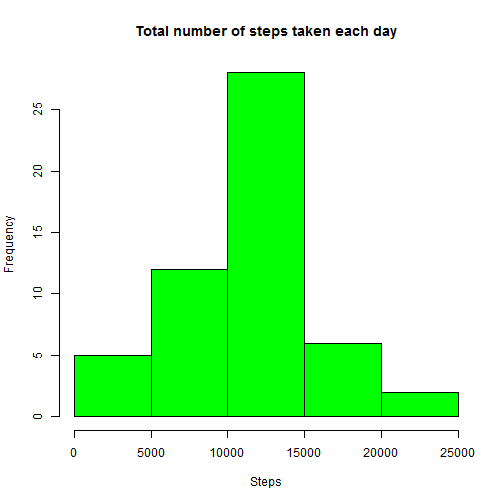

## Reproducible Research: Peer Assessment 1

### 1. Loading and preprocessing the data

```r
dat <- read.csv("activity.csv")
str(dat)
```

```
## 'data.frame':	17568 obs. of  3 variables:
##  $ steps   : int  NA NA NA NA NA NA NA NA NA NA ...
##  $ date    : Factor w/ 61 levels "2012-10-01","2012-10-02",..: 1 1 1 1 1 1 1 1 1 1 ...
##  $ interval: int  0 5 10 15 20 25 30 35 40 45 ...
```


### 2. What is mean total number of steps taken per day?
To make a histogram of the total number of steps taken each day, aggregating the data by date and getting sum of steps.

```r
sumOfSteps <- aggregate(steps ~ date, dat, sum)

hist(sumOfSteps$steps, main = "Total number of steps taken each day", xlab = "Steps", col="green")
```



Mean of the total number of steps taken per day is below.

```r
mean(dat$steps, na.rm = TRUE)
```

```
## [1] 37.3826
```

Median of the total number of steps taken per day is below.

```r
median(dat$steps, na.rm = TRUE)
```

```
## [1] 0
```


### 3. What is the average daily activity pattern?
To make a time series plot of the 5-minute interval and the average number of steps taken, aggregating the data by interval and getting average of steps.

```r
avgOfSteps <- aggregate(steps ~ interval, dat, mean)

plot(avgOfSteps$interval, avgOfSteps$steps,  type = "l", ylab = "steps", xlab = "intervals", main = "Average daily activity pattern")
```


Maximum number of septs in 5-minute interval is below.

```r
max(avgOfSteps$steps)
```

```
## [1] 206.1698
```

### 4. Imputing missing values
The raw data contained some missing values. And the total number of missing values in the data set is below.

```r
sum(is.na(dat$steps))
```

```
## [1] 2304
```

Creating a new dataset that is equal to the original dataset and filling in all of the missing values in the dataset. Missing values were filed with zero.

```r
newDat <- dat
newDat$steps[is.na(newDat$steps)] <- 0

sumOfNewSteps <- aggregate(steps ~ date, newDat, sum)
hist(sumOfNewSteps$steps, main = "Total number of steps taken each day", xlab = "Steps", col="red")
```


Mean of corrected data is below.

```r
mean(newDat$steps, na.rm = TRUE)
```

```
## [1] 32.47996
```

Median of corrected data is below.

```r
median(newDat$steps, na.rm = TRUE)
```

```
## [1] 0
```

The mean of uncorrected data and corrected data are not significantly different. So there is no impact of imputing missing data on the estimates of the total daily number of steps. 


### 5. Are there differences in activity patterns between weekdays and weekends?

Creating a new factor variable in the dataset with two levels <e2>€<93> <e2>€œweekday<e2>€<9d> and <e2>€œweekend<e2>€<9d> indicating whether a given date is a weekday or weekend day.

```r

newDat$dateType <- weekdays(as.Date(newDat$date))

getWeekdayType <- function(date) {
    ifelse (date == "<U+653C><U+3E64>† <U+653C><U+3E63>š”<U+653C><U+3E63>¼" | date == "<U+653C><U+3E63>¼<U+653C><U+3E63>š”<U+653C><U+3E63>¼", "weekend", "weekday" )
}

newDat$weekdayType <- sapply(newDat$dateType, getWeekdayType)
```

```
## Error: invalid multibyte character in parser at line 5
```

And making a panel plot containing a time series plot of the 5-minute interval and the average number of steps taken, averaged across all weekday days or weekend days.

```r
library(lattice)
weekDat <- aggregate(steps ~ interval + weekdayType, newDat, mean)
```

```
## Error in eval(expr, envir, enclos): object 'weekdayType' not found
```

```r
xyplot(steps ~ interval | factor(weekdayType), data=weekDat, aspect=1/3, type="l")
```


There are more steps on weekend than weekday.
